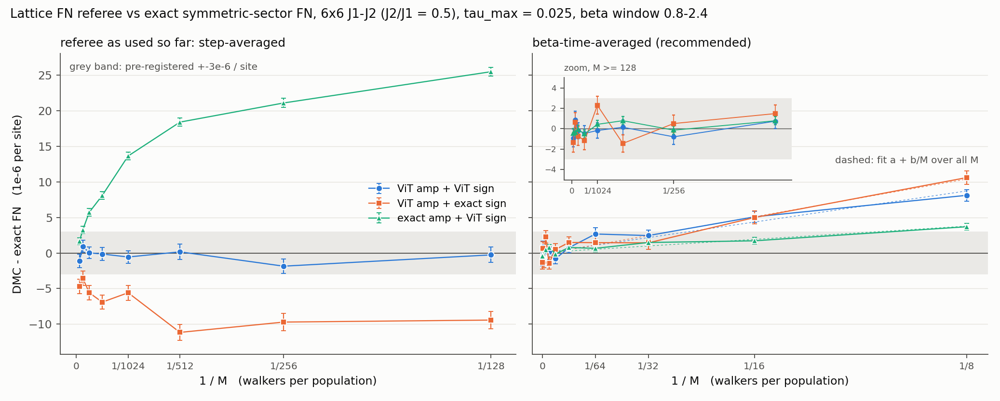

# FN referee calibration against exact FN energies, 6x6 J1-J2 (J2/J1 = 0.5)

Date 2026-10-07. Requested by the independent review (`results/review/REVIEW_2026-10-07.md`, finding 6); thresholds pre-registered in `RESEARCH_MAP.md` section 3c.
All energies are per site; "bias" = DMC - exact FN energy of the *same* guide, in units of 1e-6 per site. Code: `experiments/fn_calibration_6x6/`. Raw per-population data (2.6 GB): ws1 `/project/theorie/a/A.Otaifi/chatty_fncal6/runs/`.

## Verdict
- **Pre-registered test on the referee as used so far: FAILS.** At M = 512 the step-averaged DMC - exact FN is +0.2(1.1) / -11.2(1.1) / +18.4(0.6) for three guides. That is guide-dependent and does not shrink like 1/M (the exact-amplitude guide still has +1.7(0.5) at M = 16384).
- **The cause is the estimator, not the walker dynamics.**
  - The code averages the post-step population energy with equal weight per *step*.
  - But the step is adaptive, tau = min(tau_max, 0.8 / max(d_FN - Eref)). An extreme walker both raises the population energy and shrinks tau, so the step average over-weights exactly those populations.
  - Weighting each population energy by its beta-duration (a time average) removes the effect. No DMC has to be re-run if per-step (tau, Eref) were stored.
- **With the beta-time-averaged estimator the referee passes.**
  - For M >= 128 all 48 (guide, M, window) means are within 3.3e-6 of exact (largest 2.8 sigma; the pre-registered window 0.8-2.4 alone: within 2.3e-6), with SE 0.4-1.3e-6. The scatter of the 1024 `vitex` point (+2.3 / +3.2) is a 2.7 sigma fluctuation among 48.
  - A genuine population-control bias is visible below M = 128 and follows 1/M: bias = a + b/M, a = 0.0(0.3), -0.2(0.3), +0.1(0.1), b = 70(6), 85(7), 30(4) for the three guides.
  - Predicted bias at M = 512: 0.14, 0.17, 0.06 (all << 3e-6). It is guide-dependent only in the prefactor b, and negligible from M ~ 128 on.
- **Consequence for earlier results.**
  - DMC differences between guides measured with the step-averaged estimator are not reliable below about 3e-5/site at M <= 512 (guide-dependent offsets of -11 to +25).
  - Per-step curves were stored only by `ll6_fn.py` (`curve_beta`, `curve_E`); those runs can be re-evaluated by time weighting.
  - `it2_fn.py` runs (M = 128/512 oracles, G2, K3vit, K3a1, ViT guide) stored only the step mean and must be re-run or withdrawn.
  - The "median" rule of RESEARCH_MAP section 4 is wrong: the population median is biased by -3.7(0.4) at M = 512 for the exact-amplitude guide, and by up to +20 / -47 at M = 8.
- **Caveat (guide matching).** The exact FN energies exist only for symmetric guides. The calibration therefore uses guides defined on the 15.8M canonical representatives (value at x = value at canon(x)). The DMC referee used so far evaluates the translation-symmetrised ViT at the configuration itself, which is a *different* guide (log-amplitude asymmetry 0.006 rms; its exact FN energy is unknown). The reviewer's -8.3 / -20 / -15e-6 compare such a guide with exact numbers of the symmetrised one, so they mix a guide mismatch with the estimator artefact. They cannot be used to calibrate the referee. On the unsymmetrised ViT guide the existing data (M = 128, 400 populations: -0.503670(8); M = 512, 64 populations: -0.503666(8); step-averaged) minus exact FN of the symmetrised guide, -0.5036617, give -6(6)e-6: unresolved.

## Recommended protocol
`tau_max = 0.025, M = 512, beta window 0.8-2.4 (burn 0.8), beta-time-averaged mean over populations` (not the median, not the step mean). Restrict to the 1e-5 level only with at least 500 independent populations.

| item | value |
|---|---|
| bias at M = 512 | <= 0.2e-6 (fit); measured +0.1(0.7), -1.4(0.8), +0.8(0.4) |
| statistical error | population SD about 6e-5 (ViT amp), 3e-5 (exact amp) at M = 512; SE = SD/sqrt(n_pop), 3e-6 needs about 500 populations (cost about 1 GPU-min on a 2080 Ti) |
| window | beta 0.4-1.2 gives the same mean with 1.4x larger SE; use 0.8-2.4 |
| M = 128 | also unbiased to < 1e-6 (+0.7(0.7), +1.5(0.8), +0.8(0.4)) but with 2x the population SD; below M = 64 add b/M |
| systematic left | guide mismatch (symmetrised vs unsymmetrised guide), not quantified |

The Sorella-type correction-factor estimator (`wp20`, last 20 steps) removes about half of the small-M bias (M = 8: 8.1 -> 4.2) and changes nothing at M >= 128. It is not needed at M >= 512.

## Setup (matched guides, exactness)
- Three guides, exactly as in the stall_6x6 oracle table (`results/stall_6x6/base_validation.json`); all are defined by per-orbit tables on the 15.8M canonical reps:
  - `vitvit`: |ViT| and binarised ViT sign, exact FN -0.503661717200.
  - `vitex`: |ViT| and exact sign, -0.503662242288.
  - `exvit`: |psi0| and ViT sign, -0.503715703527.
- `fncal_exact.py` recomputes the exact sector FN energy from the *same* tables used by the DMC. It reproduces the three values to the last digit (`diff_vs_stall = 0`).
- Lumpability: for a symmetric guide the full-space FN dynamics projects exactly onto orbits. The DMC walks in full configuration space; the guide value of every configuration is that of its canonical representative.
- `fncal_pockets.py`: the allowed-edge graph of each guide is connected (one component, plus a single null-weight orbit for `exvit`). There are no nodal pockets and no pocket-memory bias.

## Referee implementation and its checks
- `fncal_dmc.py` is the algorithm of `ll6_fn.py` / `it2_fn.py` (tau = min(0.025, 0.8/max(d_FN - Eref)), Eref = population mean E_L, one hop or stay per step, systematic resampling every step), vectorised over populations on one GPU. Pool initialisation is as before.
- `fncal_test.py`: d_FN, E_L and all allowed rates agree with a brute-force CPU reference to 1e-13 on 128 states. The canonical-orbit lookup agrees with the stall_6x6 canon.
- `fncal_ref_cpu.py` is the original python walker loop on the same tables. On identical protocol it agrees with the GPU code:
  - `vitvit`, M = 16, beta 0.4-1.2 step-averaged: CPU +1.2(19), GPU +3.4(1.6).
  - `exvit`, M = 128, beta 0.4-1.2: CPU +21.3(4.0), GPU +23.7(0.9).
- tau_max study (`exvit`, M = 128, step-averaged): +25.5(0.6) at tau_max = 0.025, +5.2(1.2) at 0.0125, +0.7(1.1) at 0.00625, -1.5(1.5) at 0.003125. Conditioned on the tau of the next step the post-step energy runs from -28 to +956 (1e-6/site). The time average at tau_max = 0.025 gives +0.8(0.4).
- Long runs (beta up to 9.6, M = 1024 `vitex`, M = 256 `exvit`) show a beta-independent plateau for the step average from beta ~ 0.4, so it is not a finite-beta or pool-memory effect.

## Results (beta window 0.8-2.4; bias in 1e-6/site; SE in brackets)
Full table with beta 0.4-1.2 and both medians: `fncal_table.json`. Fits: `fncal_fits.json`.

Compact view, mean over populations (step = referee as used; tavg = beta-time average):

| M | vitvit step | vitvit tavg | vitex step | vitex tavg | exvit step | exvit tavg |
|---|---|---|---|---|---|---|
| 8 | +5.7(1.1) | +8.1(0.8) | -5.1(1.4) | +10.6(0.9) | +30.1(0.8) | +3.7(0.5) |
| 16 | +2.6(1.2) | +5.1(0.8) | -8.4(1.4) | +5.0(0.9) | +27.9(0.7) | +1.7(0.5) |
| 32 | +0.3(1.3) | +2.5(0.8) | -12.4(1.5) | +1.4(0.9) | +27.9(0.7) | +1.5(0.5) |
| 64 | +0.4(1.2) | +2.7(0.9) | -10.3(1.4) | +1.5(1.0) | +25.6(0.9) | +0.7(0.5) |
| 128 | -0.3(1.1) | +0.7(0.7) | -9.4(1.2) | +1.5(0.8) | +25.5(0.6) | +0.8(0.4) |
| 256 | -1.8(1.0) | -0.8(0.8) | -9.7(1.2) | +0.5(0.8) | +21.1(0.6) | -0.1(0.4) |
| **512** | **+0.2(1.1)** | **+0.1(0.7)** | **-11.2(1.1)** | **-1.4(0.8)** | **+18.4(0.6)** | **+0.8(0.4)** |
| 1024 | -0.6(0.9) | -0.2(0.8) | -5.6(1.1) | +2.3(0.9) | +13.7(0.6) | +0.4(0.4) |
| 2048 | -0.1(0.9) | -0.5(0.8) | -6.9(1.0) | -1.2(0.9) | +8.1(0.6) | -0.5(0.4) |
| 4096 | +0.0(0.8) | -0.2(0.8) | -5.6(1.0) | -0.7(0.9) | +5.7(0.5) | -0.1(0.4) |
| 8192 | +0.9(0.9) | +0.9(0.8) | -3.5(1.0) | +0.6(1.0) | +3.3(0.5) | -0.4(0.5) |
| 16384 | -1.1(0.9) | -0.9(0.9) | -4.7(1.0) | -1.3(1.0) | +1.7(0.5) | -0.5(0.5) |

Populations per cell: 301056 (M = 8), 160768, 80384, 35072, 25088, 12032, 6400 (M = 512), 3200, 1600, 800, 400, 200 (M = 16384). The step average slowly "improves" with M only because tau shrinks with M (tau_mean 0.023 at M = 128, 0.009 at M = 16384), which is why it looks like M^-0.4 rather than 1/M.

Fit bias = a + b/M of the beta-time-averaged mean over all M >= 8 (a in 1e-6/site, b in 1e-6/site times M):

| guide | a | b | chi2/dof | predicted bias at M = 512 |
|---|---|---|---|---|
| ViT amp + ViT sign | -0.01(0.26) | 70(6) | 9.8/10 | 0.14 |
| ViT amp + exact sign | -0.18(0.30) | 85(7) | 17.6/10 | 0.17 |
| exact amp + ViT sign | +0.06(0.14) | 30(4) | 11.1/10 | 0.06 |

Figure: left, the referee as used so far (M >= 128, step average): guide-dependent, not 1/M. Right: beta-time average over M = 8-16384, points with errors and dashed a + b/M fits; the inset zooms on M >= 128. Grey band = pre-registered +-3e-6/site.

## Compute log
About 9.3 GPU-h (RTX 2080 Ti on `inter`, one A40 for 0.04 h), plus 0.2 h of 4-core CPU for the reference loop. Breakdown: main campaign M = 128-16384, 3 guides, 7.1 h; M = 8-64 cells, 1.4 h; long-beta, tau_max and exact/pocket diagnostics, 0.9 h. Budget was 20 GPU-h.
