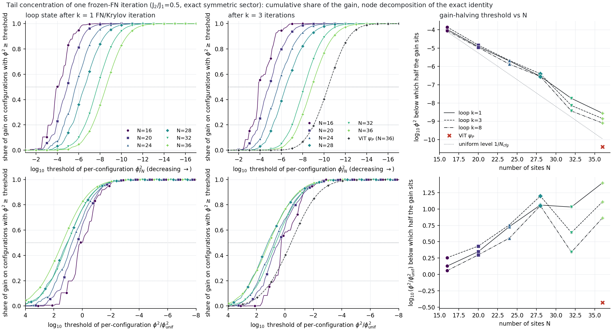

# Tail concentration of one frozen-FN iteration vs system size (exact, CPU)

Date 2026-10-08. J2/J1 = 0.5, exact symmetric sector (k=0, A1, spin-flip even). Code: `experiments/tail_vs_N/`
(`tvn.py` exact diagnostics, `analyze.py`, `make_tables.py`, `figure.py`). Raw per-state histograms: `tvn_N*.json`
(N36 = `tvn_N36.json` + `tvn_N36_v2.json`, merged by `analyze.load`); derived: `metrics.json`, `tables.md`;
figure `tail_vs_N.png` / `.pdf`.

## Question
Is the 6x6 failure of the tail write-back (81% of the frozen-FN gain on 7.6% of the phi^2 weight, half of it on
configurations with phi^2 < 1e-11; sampled 4x4 write-back worked at ~90%) a size effect of tail concentration?

## Answer in five lines
1. **Tail concentration does not grow with N for the loop guides.** At fixed k the phi^2 weight that carries the lower half
   of the gain is 11.5, 16.9, 17.7, 18.2, 18.2, 19.9% (k=1; N = 16 ... 36) and 13.8 ... 11.6% (k=3), i.e. flat to slightly
   *less* concentrated; relative to the uniform level the gain-halving threshold moves *up* (x50 = +0.13 -> +1.4 decades).
2. **What does grow, exponentially, is the number of configurations that must be corrected:** t50 falls from 1e-4 to
   3e-9 (k=1) tracking the Hilbert space (about -0.23 decades/site vs -0.29 for the uniform level), 85% -> 99.6% of all
   configurations lie below t50 and the smallest set holding 50% of the gain grows 2e3 -> 3e7 configurations
   (17% -> 0.32% of the space). The 4x4 sampled write-back used N = 1e4 samples per step on a space of 1.3e4 configurations
   (107 orbits): it simply covered the whole support.
3. **The ViT psi_P at 6x6 is a different object:** half of its gain sits below phi^2 = 4e-11 (x50 = -0.43, i.e. on
   configurations *less* probable than uniform), 1.0% of the weight carries 50% and 7.3% carries 80% (reproduces the
   7.6% / 81% of `writeback_tail`), whereas a loop state at 6x6 with G = 1e-4 still has x50 = +0.86 and 7.1% weight.
   Along the loop at fixed N the concentration rises as the guide improves (N=36: 19.9 -> 11.6 -> 7.1% weight for k = 1, 3, 8).
4. Hence the failure is **guide quality (a residual that lives in the tail) times exponential support growth, not a
   size trend of concentration** for loop guides; size and guide cannot be separated for the ViT (only one ViT guide, at 6x6),
   and no loop state at 6x6 reaches the ViT's G (smallest 1.1e-4 vs 3.0e-5).
5. Implication: sampled write-back must resolve >= 1e8 (50% of G, ViT) to 9e8 (80%) configurations of the 6x6 sector,
   against ~1e4 samples per step that sufficed at 4x4; any mechanism that works at 4x4 by coverage will not scale.

## Definitions (same as `writeback_tail`)
Guide (a, s); F = H_FN[a, s]; phi_FN = Perron vector of F (E_FN); delta* = log phi_FN - log a;
G = (E_F[a] - E_FN)/N (exact Rayleigh quotient, per site); Q(delta) = 1/(2N) sum_xy |F_xy| phi_x phi_y (delta_x - delta_y)^2
(sum over ordered pairs of allowed edges). Node weight c_x = 1/2 sum_y |F_xy| phi_x phi_y (...)^2 (each edge split equally
between its end points).
- **Exact nonlinear decomposition.** Since F phi = E phi, `<a|F-E|a> = 1/2 sum_xy |F_xy| phi_x phi_y (a_x/phi_x - a_y/phi_y)^2`
  exactly; its node/edge split is the "exact" decomposition used for every curve (`c_exact`), it sums to G to 4e-8
  (relative) for all 49 states. The quadratic form Q (`c_quad`, `Q/G`) is the second-order approximation: Q/G = 0.79-0.90
  for the early loop states (rms delta 0.05-0.17), 0.96-0.97 at k = 8, **1.02 for the ViT** (G = 3.0108e-5 per site,
  Q = 3.078e-5; the G agrees with the `writeback_tail` G0 = 3.01e-5). For the guide phi exp(-eps delta) the ratio
  eps^2 Q / G(eps) = 0.80, 0.90, 0.95, 0.98 at eps = 1, 0.5, 0.25, 0.1 (N=36, k=3): -> 1 linearly in eps, i.e. second-order agreement.
- Per-configuration phi^2 = phi_r^2 / n_r (n_r orbit size; sums to 1 over configurations); thresholds in log10; bins of
  1/8 decade. x = log10(phi^2 N_cfg) is the threshold relative to the uniform level 1/N_cfg (N_cfg = C(N, N/2)).
- **t50**: threshold such that configurations with phi^2 >= t50 carry 50% of the gain (= those below carry 50%).
  **t80**: configurations below t80 carry 80% of the gain. "mass below" = their phi^2 weight; "orbits/configs below" = counts.
  "min #configs": smallest set of configurations (ranked by gain per configuration) that carries 50% / 80% of G.
- Truncation curves (exact nonlinear): energy gain when f = delta* on the set {phi^2 >= t} (or < t) and 0 elsewhere, share of G.
- Loop = plain (no acceleration) `closed_fn_krylov_sym6x6` loop from the J2 = 0 ground-state amplitude with Marshall signs:
  (v, s) -> FN solve -> v := phi_FN, s := Krylov(phi_FN, s) (energy-optimal threshold). "After k iterations" = the guide
  (a_k, s_k); the FN iteration analysed is the next one, F = H_FN[a_k, s_k] (k = 0 is the start). FN eigenvector: LOBPCG,
  then masked Jacobi sweeps on the rows with D_FN - E > 1 until the relative change of every component is < 1e-9
  (the eigensolver's tolerance is absolute and leaves 1e-6..1e-4 relative errors in the deep tail; the exact-identity check
  above is the accuracy test: it holds to 4e-8 in the worst state).
- Clusters: N16 = 4x4 square torus; N36 = 6x6 square torus; N20, N24, N28, N32 are the tilted tori of
  `sign_design_tests/b_depth_sym.sbatch` (T = (4,0),(1,5); (4,0),(0,6); (4,0),(1,7); (4,4),(-4,4)). The N32 torus has a
  larger point group and converges faster (G smaller at the same k), which explains its dip in the trend panels.
- (B) ViT: the symmetrised psi_P of `stall_6x6` (`sym_tables.npz`, ordering asserted equal to the basis).

## Figure

`tail_vs_N.png`: top row, share of the exact gain carried by configurations with phi^2 >= threshold (one marker per decade),
for the loop state after k = 1 and k = 3 (+ ViT at N = 36, dashed black); bottom row, the same against
the threshold relative to the uniform level; right column, the gain-halving threshold t50 (absolute and relative) vs N.

## Tables (exact decomposition `c_exact`; t in log10 phi^2)
**loop after k = 1**

| N | N_cfg | G /site | Q/G | t50 | x50 | phi^2 mass below t50 | orbits below t50 / orbits | configs below t50 (share) | t80 | mass below t80 | orbits below t80 | min #configs (share) for 50% of G | for 80% of G |
|---|---|---|---|---|---|---|---|---|---|---|---|---|---|
| 16 | 1.29e+04 | 3.96e-03 | 0.80 | -3.98 | +0.13 | 11.5% | 8.24e+01 / 1.07e+02 | 1.09e+04 (85.0%) | -3.39 | 41.3% | 9.97e+01 | 16.64% (2.1e+03) | 38.77% (5.0e+03) |
| 20 | 1.85e+05 | 4.06e-03 | 0.85 | -4.92 | +0.35 | 16.9% | 2.35e+03 / 2.52e+03 | 1.74e+05 (94.4%) | -3.92 | 51.3% | 2.49e+03 | 4.92% (9.1e+03) | 19.59% (3.6e+04) |
| 24 | 2.70e+06 | 4.23e-03 | 0.84 | -5.70 | +0.73 | 17.7% | 1.51e+04 / 1.56e+04 | 2.64e+06 (97.5%) | -4.63 | 52.4% | 1.55e+04 | 2.42% (6.6e+04) | 12.35% (3.3e+05) |
| 28 | 4.01e+07 | 4.29e-03 | 0.83 | -6.54 | +1.06 | 18.2% | 3.57e+05 / 3.61e+05 | 3.97e+07 (99.0%) | -5.36 | 53.0% | 3.61e+05 | 0.84% (3.4e+05) | 5.99% (2.4e+06) |
| 32 | 6.01e+08 | 2.72e-03 | 0.82 | -7.75 | +1.03 | 18.2% | 1.17e+06 / 1.18e+06 | 5.95e+08 (99.0%) | -6.59 | 49.8% | 1.18e+06 | 0.86% (5.2e+06) | 5.96% (3.6e+07) |
| 36 | 9.08e+09 | 3.13e-03 | 0.83 | -8.56 | +1.40 | 19.9% | 1.57e+07 / 1.58e+07 | 9.04e+09 (99.6%) | -7.29 | 52.6% | 1.58e+07 | 0.32% (2.9e+07) | 3.00% (2.7e+08) |

**loop after k = 3**

| N | N_cfg | G /site | Q/G | t50 | x50 | phi^2 mass below t50 | orbits below t50 / orbits | configs below t50 (share) | t80 | mass below t80 | orbits below t80 | min #configs (share) for 50% of G | for 80% of G |
|---|---|---|---|---|---|---|---|---|---|---|---|---|---|
| 16 | 1.29e+04 | 1.11e-03 | 0.90 | -3.85 | +0.26 | 13.8% | 8.59e+01 / 1.07e+02 | 1.13e+04 (88.2%) | -3.33 | 36.7% | 9.83e+01 | 10.12% (1.3e+03) | 35.54% (4.6e+03) |
| 20 | 1.85e+05 | 1.43e-03 | 0.86 | -4.83 | +0.43 | 14.1% | 2.38e+03 / 2.52e+03 | 1.76e+05 (95.5%) | -3.83 | 49.5% | 2.49e+03 | 3.67% (6.8e+03) | 14.82% (2.7e+04) |
| 24 | 2.70e+06 | 1.32e-03 | 0.85 | -5.68 | +0.76 | 14.1% | 1.51e+04 / 1.56e+04 | 2.65e+06 (97.9%) | -4.55 | 49.8% | 1.55e+04 | 1.91% (5.2e+04) | 9.02% (2.4e+05) |
| 28 | 4.01e+07 | 1.30e-03 | 0.84 | -6.40 | +1.20 | 15.8% | 3.58e+05 / 3.61e+05 | 3.98e+07 (99.3%) | -5.20 | 51.5% | 3.61e+05 | 0.70% (2.8e+05) | 4.33% (1.7e+06) |
| 32 | 6.01e+08 | 6.07e-04 | 0.79 | -8.14 | +0.64 | 9.3% | 1.16e+06 / 1.18e+06 | 5.90e+08 (98.2%) | -7.00 | 33.5% | 1.18e+06 | 0.98% (5.9e+06) | 6.33% (3.8e+07) |
| 36 | 9.08e+09 | 7.42e-04 | 0.80 | -8.85 | +1.11 | 11.6% | 1.57e+07 / 1.58e+07 | 9.02e+09 (99.4%) | -7.61 | 39.0% | 1.58e+07 | 0.50% (4.5e+07) | 3.14% (2.9e+08) |

**loop after k = 8**

| N | N_cfg | G /site | Q/G | t50 | x50 | phi^2 mass below t50 | orbits below t50 / orbits | configs below t50 (share) | t80 | mass below t80 | orbits below t80 | min #configs (share) for 50% of G | for 80% of G |
|---|---|---|---|---|---|---|---|---|---|---|---|---|---|
| 16 | 1.29e+04 | 1.89e-04 | 0.96 | -4.05 | +0.06 | 7.5% | 8.08e+01 / 1.07e+02 | 1.10e+04 (85.1%) | -3.29 | 33.1% | 9.73e+01 | 15.60% (2.0e+03) | 26.08% (3.4e+03) |
| 20 | 1.85e+05 | 1.27e-04 | 0.97 | -4.97 | +0.30 | 8.4% | 2.35e+03 / 2.52e+03 | 1.75e+05 (94.6%) | -3.86 | 43.1% | 2.49e+03 | 3.63% (6.7e+03) | 14.33% (2.6e+04) |
| 24 | 2.70e+06 | 1.24e-04 | 0.97 | -5.88 | +0.55 | 8.6% | 1.51e+04 / 1.56e+04 | 2.64e+06 (97.5%) | -4.56 | 43.3% | 1.55e+04 | 1.40% (3.8e+04) | 6.84% (1.9e+05) |
| 28 | 4.01e+07 | 1.18e-04 | 0.97 | -6.55 | +1.05 | 10.5% | 3.58e+05 / 3.61e+05 | 3.98e+07 (99.1%) | -5.26 | 45.5% | 3.61e+05 | 0.58% (2.3e+05) | 2.70% (1.1e+06) |
| 32 | 6.01e+08 | 8.31e-05 | 0.97 | -8.44 | +0.34 | 5.4% | 1.15e+06 / 1.18e+06 | 5.85e+08 (97.4%) | -7.12 | 28.0% | 1.18e+06 | 1.00% (6.0e+06) | 4.83% (2.9e+07) |
| 36 | 9.08e+09 | 1.07e-04 | 0.97 | -9.10 | +0.86 | 7.1% | 1.57e+07 / 1.58e+07 | 9.00e+09 (99.1%) | -7.69 | 33.3% | 1.58e+07 | 0.38% (3.4e+07) | 2.39% (2.2e+08) |

**symmetrised ViT psi_P**

| N | N_cfg | G /site | Q/G | t50 | x50 | phi^2 mass below t50 | orbits below t50 / orbits | configs below t50 (share) | t80 | mass below t80 | orbits below t80 | min #configs (share) for 50% of G | for 80% of G |
|---|---|---|---|---|---|---|---|---|---|---|---|---|---|
| 36 | 9.08e+09 | 3.01e-05 | 1.02 | -10.39 | -0.43 | 1.0% | 1.52e+07 / 1.58e+07 | 8.70e+09 (95.9%) | -9.04 | 7.3% | 1.57e+07 | 1.97% (1.8e+08) | 9.78% (8.9e+08) |

Edge attribution (each edge assigned to its less probable end point, `eq_min`/`ex_min` in `metrics.json`) shifts t50 deeper by
0.3-1.2 decades (N=36 ViT: -10.4 -> -11.0) with the same N-trend; the quadratic form gives t50 within 0.35 decades of the exact one.

## Exact truncation, N = 36 (share of the exact G captured when f = delta* on the set, 0 elsewhere)
| threshold | loop k=1: f on phi^2 >= t | on < t | loop k=3: >= t | < t | ViT: >= t | < t |
|---|---|---|---|---|---|---|
| 1e-5 | -0.03 | 0.95 | -0.01 | 0.99 | -0.00 | 1.00 |
| 1e-7 | -0.05 | 0.61 | -0.02 | 0.85 | 0.00 | 1.00 |
| 1e-9 | 0.33 | 0.25 | 0.19 | 0.45 | 0.04 | 0.90 |
| 1e-11 | 0.73 | -0.02 | 0.72 | 0.08 | 0.44 | 0.43 |
| 1e-13 | 0.97 | -0.01 | 0.98 | 0.01 | 0.91 | 0.06 |
Perfect correction of every configuration above 1e-9 captures 4% of the ViT's gain (5.6% with the quadratic optimum in
`writeback_tail`); it needs 1e-11 for ~44%, consistent with the node-share t50 = 10^-10.4.

## Caveats
- Loop guides and the ViT are different guide families; the loop at 6x6 only reaches G = 1.1e-4 (k = 8), 3.5x above the ViT.
  Within the loop, x50 at N=36 falls 1.40 -> 1.11 -> 0.86 as G falls 3.1e-3 -> 7.4e-4 -> 1.1e-4, but the ViT (x50 = -0.43) lies
  below any plausible extrapolation of that slow trend, so its tail structure is not just "a better loop state".
- N20-N32 use different cluster geometries; trends in N mix size and shape (N32 visibly).
- Node attribution splits cross edges equally; the edge-based variants (min/max end point) are in `metrics.json`.
- Bins are 1/8 decade; crossings and counts are linearly interpolated within a bin (counts good to ~10%).

## Compute
Exact, CPU only: ws1 login node, 8 threads (Slurm `cluster` jobs stayed pending behind fair-share priority; cancelled).
About 12 CPU-h in total (N36: 3 runs of 30-55 min x 8 threads, mostly CSR build 5 min + FN solves 3 min each +
Jacobi/diagnostics; N16-N32 < 0.5 CPU-h). Working data on ws1 `/project/theorie/a/A.Otaifi/chatty_tail_vs_N/` (logs, caches).
Reproduce: `python tvn.py --cluster N36 --kmax 8 --vit --diag-k 1,3,8 --no-trunc ...` (N36), `--cluster N16..N32 --kmax 8` (others),
then `analyze.py`, `make_tables.py`, `figure.py`.
